# Tutorial

The following tutorial helps understand the variaous functions within this vscode extension. Following from the start to end gives the best overview for new starters.

## How it works

Think of this extension like a file bridge between your computer and your embedded Python device.

You connect a device to a folder on your computer, then sync files both ways. That means no more constant copy/paste, and you always have a backup of your device code on your computer.

You can choose files to skip during sync. This is useful for things like passwords or device-only settings that should stay private.

You can also point multiple devices at the same project folder. Great for reusing code. If each device needs different settings (like `config.py`), just exclude that file so devices do not overwrite each other.

Shared library folders are supported too. These are common folders (outside a project) where you keep reusable code like WiFi or MQTT helpers, then sync that code to any device that needs it.

The difference compare tool shows what changed between a file on your computer and the same file on the device, so you know when to sync.

You can also open the REPL window to run Python commands directly on the device for quick testing and print debugging.

## Workspace folder structure

A workspace is just any folder on your computer where you want to keep your Python files. It is easier and cleaner to create a dedicated folder for the workspace so that other files do not clutter the explorer view.

When a workspace is initialised, your project folder becomes the "home" for device mappings and sync settings.

A simple example might look like this:

```text
my-project/
|-- .pydevice-config
|-- .pydevice-cache
`-- devices/
    |-- sensor-01/
    |   |-- main.py
    |   `-- lib/
    `-- sensor-02/
    |   |-- main.py
    |   `-- lib/
    `-- switch-01/
        |-- main.py
        `-- lib/
```

What each part is for:

- `devices/` (or any folders you choose): these are the local folders your devices map to.
- `.pydevice-config`: shared project settings. This should usually be committed so other developers get the same workspace setup. 
- `.pydevice-cache`: local developer cache/settings. This is for user-specific preferences and usually isn't shared.

## Open and initialise workspace

### Open workspace folder

A workspace folder must be open in VS Code before you can initialise it.

You can open a folder from the VS Code file browser:

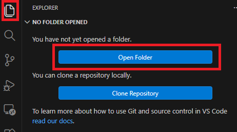

Or from the PyDevice workspace view, which will take you to the same folder picker:

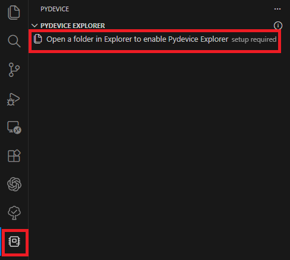

### Initialise workspace

After your folder is open, click **Initialise Workspace**.

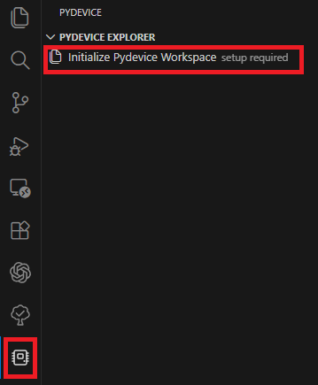

That sets up the PyDevice files and view for this project.

When it is done, your workspace should look like this:

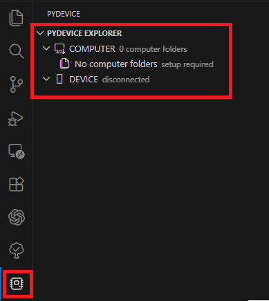

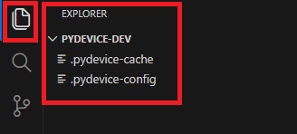

> IMPORTANT NOTE: If you picked a workspacefolder that already has files and folders then you will see those as well (they are not deleted or modified).

## Connect devices

### Auto detect and connect

You can auto detect connected devices.

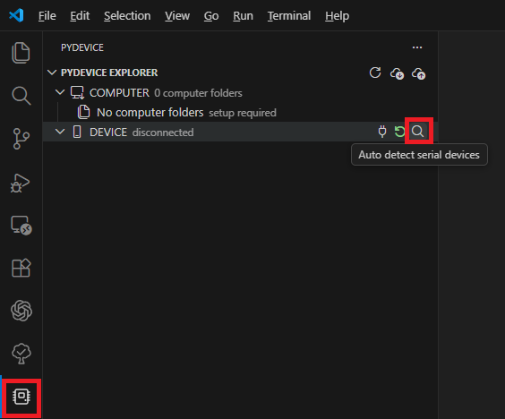

<table>
  <tr>
    <th align="left">Windows</th>
    <th align="left">Linux/Mac</th>
  </tr>
  <tr>
    <td valign="top">
      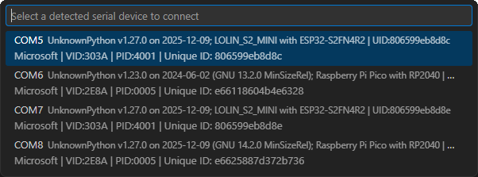
    </td>
    <td valign="top">
      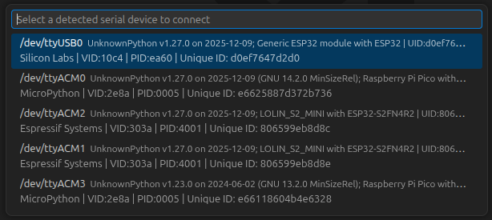
    </td>
  </tr>
</table>

> Clicking any device in the list will connect to that device.

### Connect by serial port

You can also try connecting by selecting a serial port. This will let you pick any serial port, whether a device is known to be connected or not.

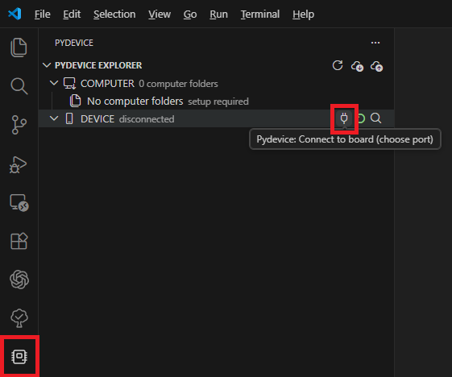

<table>
  <tr>
    <th align="left">Windows</th>
    <th align="left">Linux/Mac</th>
  </tr>
  <tr>
    <td valign="top">
      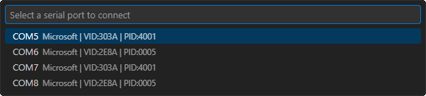
    </td>
    <td valign="top">
      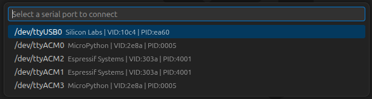
    </td>
  </tr>
</table>  

> Clicking any device in the list will connect to that device.

## Create computer folder to sync device

## Change device file and compare

## Create a library

## Sync from a new device (code not on computer)

## Sync to a new device, no code on device yet.

## Map a device to an exist folder and to a file compare to see what is different across the device

### File synchronisation and change comparison

